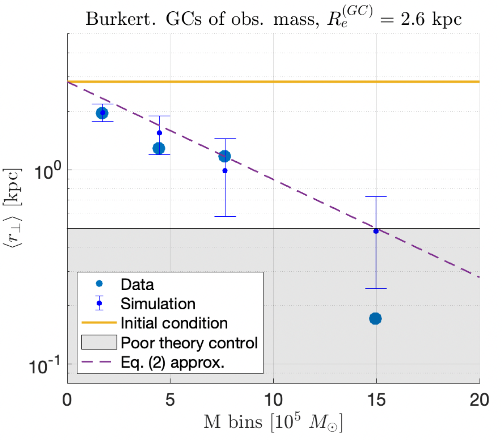

# DFUDGs

An N-body simulation with semi-analytic dynamical friction, geared towards dynamics of globular-cluster rich ultra-diffuse galaxies.

## Results
<p align="center">

</p>

The above is an example of the result of 40 realizations of massive candidate globular clusters (GCs) of NGC5846-UDG1 in a Burkert profile, integrated over 10 Gyr. Initial conditions of GCs are taken to be common across different GC masses. 

## Usage

To generate the simulations, run

```bash
MainScript.m
```

To generate figures, run

```bash
MainScriptPrint.m
```

To generate a video, run

```bash
MainScriptVideo.m
```

## License

This code is under [MIT](https://opensource.org/licenses/MIT) license. 

## BibTeX entry
If you use this code or find it in any way useful for your research, please cite Bar, Danieli, and Blum (2022). The BibTeX entry is: 

@article{BDBDFUDG1,
	author = "Bar, Nitsan and Danieli, Shany and Blum, Kfir",
	title = "{Dynamical friction in globular cluster-rich ultra-diffuse galaxies: the case of NGC5846-UDG1}",
	eprint = "2202.10179",
	archivePrefix = "arXiv",
	primaryClass = "astro-ph",
	year = "2022"
}

