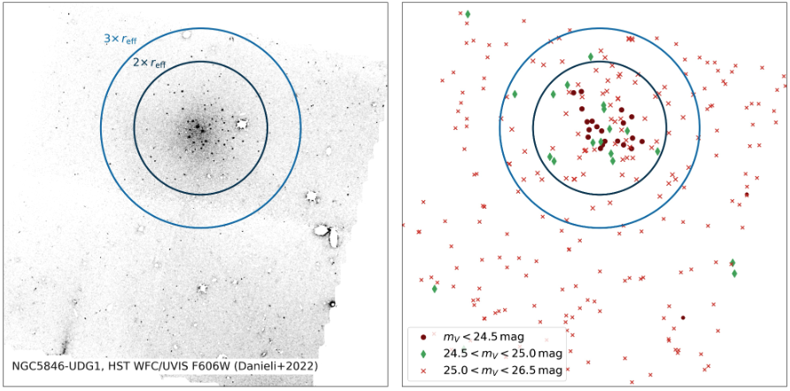
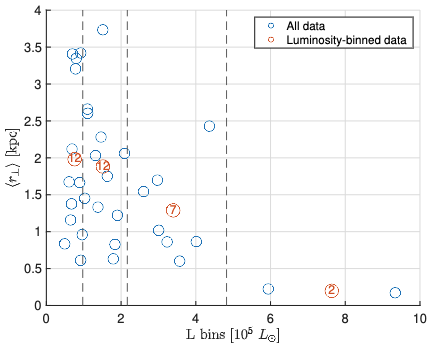
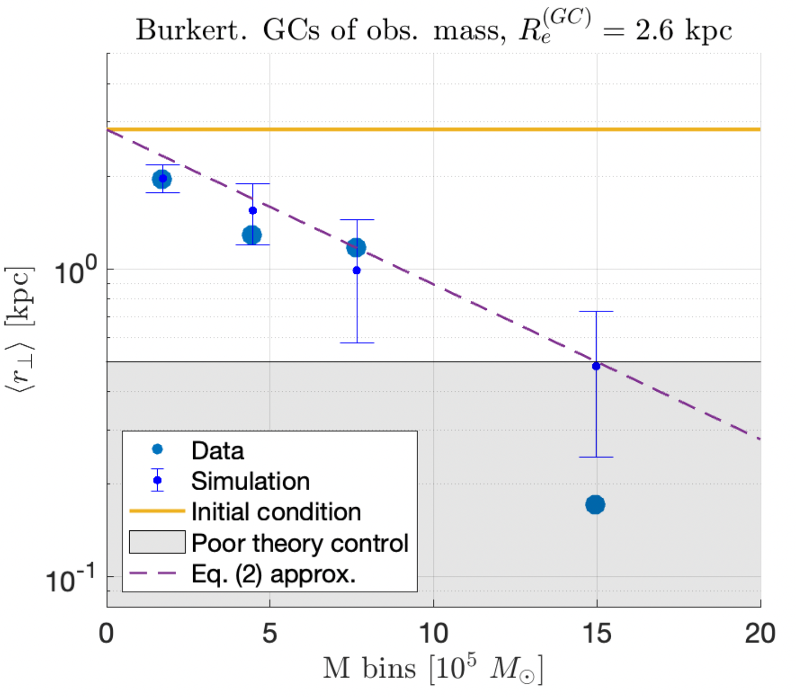

# DFUDGs

An N-body simulation with semi-analytic dynamical friction, geared towards dynamics of globular-cluster rich ultra-diffuse galaxies.

## Sample Results

Here we reproduce some of the main figures from [Bar et al. (2022)](https://arxiv.org/abs/2202.10179) (see citation below) that demonstrate the data that the code is useful for.

<p align="center">

</p>
The above is a reproduction of the Hubble Space Telescope data of NGC5846-UDG1 galaxy from Danieli et al. (2022), binned into luminosity bins with circles charcterising the stellar body.


<p align="center">


</p>

The above is an example of the result of 40 realizations of 33 massive candidate globular clusters (GCs) of NGC5846-UDG1 in a Burkert profile, integrated over 10 Gyr. Initial conditions of GCs are taken to be common across different GC masses. The error-bars of simulations denote 1-&sigma; confidence intervals. Eq. (2) approx. refers to a simple analytic approximation developed in Bar et al. (2022) which reasonably agrees with simulations.

## Usage

To generate all simulations, run

```bash
MainScript.m
```

To generate all figures, run

```bash
MainScriptPrint.m
```

To generate a video, run

```bash
MainScriptVideo.m
```

It is recommended to treat the different scripts as notebooks and to run a subset of them.

## License

This code is under [MIT](https://opensource.org/licenses/MIT) license. 

## BibTeX entry
If you use this code or find it in any way useful for your research, please cite Bar, Danieli, and Blum (2022). The BibTeX entry is: 

@article{Bar:2022liw,  
    author = "Bar, Nitsan and Danieli, Shany and Blum, Kfir",  
    title = "{Dynamical friction in globular cluster-rich ultra-diffuse galaxies: the case of NGC5846-UDG1}",  
    eprint = "2202.10179",  
    archivePrefix = "arXiv",  
    primaryClass = "astro-ph.GA",  
    year = "2022"  
}
